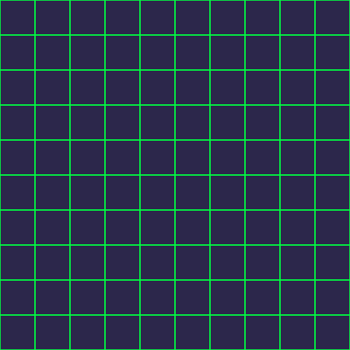
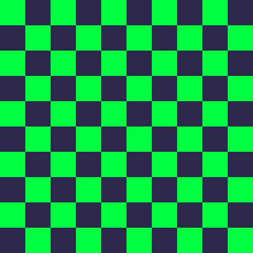
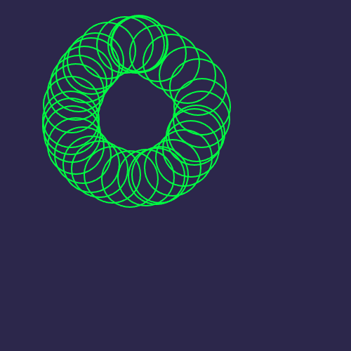
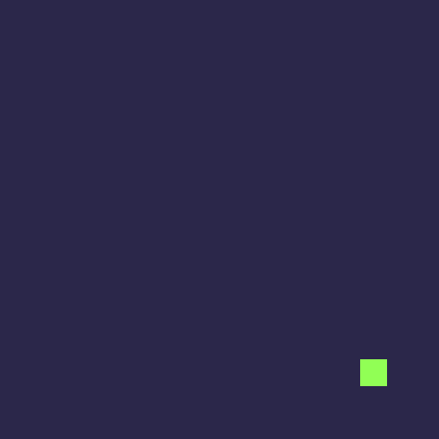
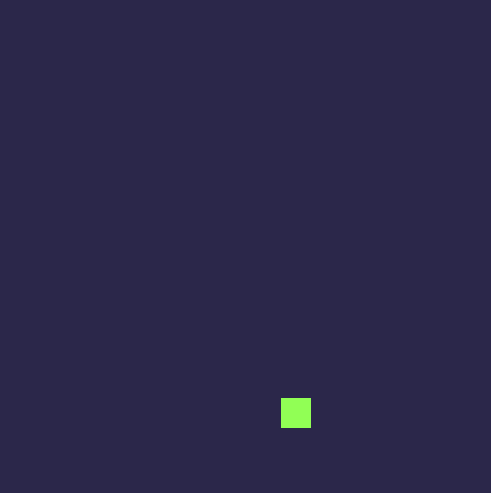

# Ejercicios 2D `<canvas>`

```js
canvas.width = 500;
canvas.height = 500;

const ctx = canvas.getContext("2d");
const verdeMatrix = "#00ff41";
const fondoNegro = "#2c274b";

// Dibujamos el fondo
function limpiar() {
    ctx.fillStyle = fondoNegro;
    ctx.fillRect(0,0, canvas.width,canvas.height);
}

limpiar();
```

##  Ejercicio 1 — Dibuja una cuadrícula (base para coordenadas)
#### Aprender el **sistema de coordenadas del canvas** y entender la relación entre píxeles y unidades

```js
const anchoCuadricula = 50;
const altoCuadricula = 50;
const cantidad = (canvas.width / anchoCuadricula) * (canvas.height / altoCuadricula);

let origenX = 0;
let origenY = 0;

for(let i = 0; i < cantidad; i++) {

    ctx.strokeStyle = verdeMatrix;
    ctx.lineWidth = 2;
    ctx.strokeRect(origenX, origenY, anchoCuadricula, altoCuadricula);
    
    origenX += 50;
    if(origenX > 450) {
        origenX = 0;
        origenY += 50;
    }
}
```



---

##  Ejercicio 1.2 -> Tablero tipo ajedrez

```js
const anchoCuadricula = 50;
const altoCuadricula = 50;
const cantidadTotal = (canvas.width / anchoCuadricula) * (canvas.height / altoCuadricula);

let posicionY = 0;
let origenX = 0;
let origenY = 0;

for(let i = 0; i < cantidadTotal; i++) {

    // Los pares en el eje vertical arrancan con el verde
    if(posicionY % 2 === 0) {
        
        if (i % 2 == 0) {
            ctx.fillStyle = verdeMatrix;
            ctx.fillRect(origenX, origenY, anchoCuadricula, altoCuadricula);
        } else {
            ctx.fillStyle = fondoNegro;
            ctx.fillRect(origenX, origenY, anchoCuadricula, altoCuadricula);
        }
        
    
    // Los impares en el eje vertical arrancan con el azul
    } else {
        if (i % 2 == 0) {
            ctx.fillStyle = fondoNegro;
            ctx.fillRect(origenX, origenY, anchoCuadricula, altoCuadricula);
        } else {
            ctx.fillStyle = verdeMatrix;
            ctx.fillRect(origenX, origenY, anchoCuadricula, altoCuadricula);
        }
    }
    
    origenX += 50;
        
    if(origenX > 450) {
        origenX = 0;
        origenY += 50;
        posicionY += 1;
    }
}
```



---


##  Ejercicio 2 — Dibuja un círculo donde haga clic el mouse
#### Conectar **eventos → coordenadas → dibujo** para aprender a mapear valores

```js
canvas.addEventListener("click", (event) => {

    // Obtener posicion del mouse al hacer click
    let rect = canvas.getBoundingClientRect();
    const scaleX = canvas.width / rect.width;
    const scaleY = canvas.height / rect.height;

    const xOrigin = (event.clientX - rect.left) * scaleX;
    const yOrigin = (event.clientY - rect.top) * scaleY;

    console.log(`Coordenadas x e y : ${xOrigin} ${yOrigin}`);

    // Donde hagamos click dibujamos
    ctx.beginPath();
    ctx.arc(xOrigin, yOrigin, 40, 0, Math.PI * 2);
    ctx.lineWidth = 2; // ancho del borde 2px
    ctx.strokeStyle = verdeMatrix; // color dle borde
    ctx.stroke(); // Dibuja el contorno del segmento
});
```




---


## Ejercicio 3 — Movimiento lineal: pelota moviendose
#### Entendiendo el concepto de render loop

```js
let xPosition = 0;
let yPosition = 0;

// Primer cuadro
ctx.fillStyle = verdeMatrix;
ctx.fillRect(xPosition, yPosition, 30, 30);

setInterval(() => {
    // Borramos el tramo anterior
    ctx.fillStyle = fondoNegro;
    ctx.fillRect(xPosition, yPosition, 30, 30);
    

    xPosition++; // Aumentamos la posicion en el eje X
    yPosition++;

    if(xPosition > 500) {
        xPosition = 0;
    }

    if(yPosition > 500) {
        yPosition = 0;
    }
    
    // Dibujamos cuadros
    ctx.fillStyle = "#00ff41";
    ctx.fillRect(xPosition, yPosition, 30, 30);

}, 2);
```




---


## Ejercicio 4 — Rebotando en los bordes, colision con paredes
#### Detección de colisiones

```js
let xPosition = 0;
let ancho = 30;
let alto = 30;
let xBorder = false;
let yLimit = false;

// Los limites son 0 y 470 (500 - 30px del cuadrado)
let yPosition = Math.floor(Math.random() * 470) + 1; 

// Primer cuadro
ctx.fillStyle = verdeMatrix;
ctx.fillRect(xPosition, yPosition, ancho, alto);


// Movimiento de la pieza
function movement(direction) {
    // Borramos el tramo anterior
    ctx.fillStyle = fondoNegro;
    ctx.fillRect(xPosition, yPosition, ancho, alto);

    // Definimos la velocidad de frames
    if (direction == "right") {
        xPosition += 5;
    } else {
        xPosition -= 5;
    }
    console.log(xPosition);

    // Pintamos el nuevo tramo
    ctx.fillStyle = verdeMatrix;
    ctx.fillRect(xPosition, yPosition, ancho, alto);
}

// Loop principal del juego
function loop() {

    // Definimos el movimiento que va a tomar en funcion de su posicion en el eje x (horizontal)
    
    // Si es > 0 y no toco el borde, va a la derecha
    if(xPosition >= 0 && !xBorder) {
        movement("right");
        if(xPosition == 470) {
            xBorder = !xBorder;

        }
    } 
    
    // Si es > 0 y ya toco borde, va a la izquierda
    if(xPosition >= 0 && xBorder) {
        //xBorder = !xBorder; // Indicamos que llego al limite
        movement("left");
        if(xPosition == 0) {
            xBorder = !xBorder;
        }
    }

    requestAnimationFrame(loop);
}

loop();
```




---


## Ejercicio 4.1 — Rebotando en el borde inferior, simulando saltos
#### Simulacion de fisica

```js
////////////////////////////
// Variables del jugador //
let ancho = 30; // Definimos los pixeles del cuadrado
let alto = 30;
let posicionX = (canvas.width / 2) - ancho; // 220 -> Centrado horizontal
let posicionY = canvas.height - alto; 
let piso = canvas.height - alto; // 470 -> Fijamos la posicion del suelo


//////////////////////////
// Variables de fisica //
let velocidadY = 0; // Que tan rapido se mueve verticalmente
let gravedad = 0.5; // Aceleracion constante hacia abajo (que tan rapido cae)
let fuerzaSalto = -10; // Impulso inicial cara arriba (que tan fuerte salta)


/////////////
// Dibujo //
function dibujar() {
    // 1. Limpiamos todo el canvas (+ optimo)
    ctx.fillStyle = fondoNegro; 
    ctx.fillRect(0, 0, canvas.width, canvas.height);

    // 2. Dibujamos el cuadrado en su nueva posicion
    ctx.fillStyle = verdeMatrix;
    ctx.fillRect(posicionX, posicionY, ancho, alto);
}


/////////////////
// Actualizar //
function actualizar() { // Aplicamos la logica del salto
    // Subir implica decrecer las coordenadas Y (0 arriba de todo, -470 piso)

    velocidadY += gravedad; // Aplicamos gravedad a la velocidad
    
    posicionY += velocidadY; // Aplicamos velocidad a la posicion
    
    // Colision con el piso
    if(posicionY > piso) {
        posicionY = piso; // Lo forzamos a quedarse en el piso
        velocidadY = 0; // Ya no hay movimiento vertical
    }
}


////////////
// Input //
document.addEventListener("keydown", event => {
    if(event.code === "Space") {
        velocidadY = fuerzaSalto; // Aplicamos el impulso hacia arriba
        
        console.log(posicionY);
    }
});


////////////////
// Game Loop //
function loop() { // Bucle principal
    actualizar(); // Calculamos las matematicas
    dibujar(); // Renderizamos en la pantalla

    // Loop 60 veces x segundo, el juego esta activo esperando input
    requestAnimationFrame(loop); // // Llamamos al siguiente frame
    // console.log("test"); // Testeo de loop por consola
}


loop(); // Iniciar
```

---


## Ejercicio 5 — Movimiento circular con seno y coseno
#### Dibujar trayectorias circulares

```js

```