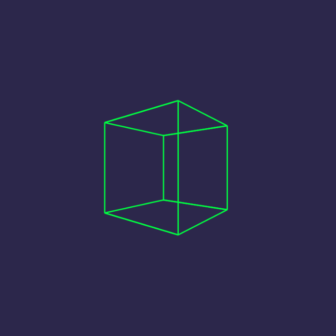
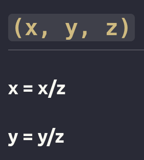

# JS-3D-Graphics

### Qué hace el código?

- Dibujamos un **cubo 3D**
- Lo **rotamos**
- Lo **proyectamos en 2D**
- Lo dibujamos en un `<canvas>` usando puntos y líneas

No es 3D real con GPU, sino **3D simulado con matemáticas** (como los primeros videojuegos)




### Pipeline
Para cada vértice:

```
3D original
 ↓
rotación
 ↓
traslación (z)
 ↓
proyección (3D → 2D)
 ↓
adaptación a pantalla
 ↓
dibujar
```

Este flujo es el mismo que usan con la GPU OpenGL, WebGL y los motores 3D

---

### Idea inicial

Partiremos de una fórmula matemática que nos permitirá renderizar puntos 3D en nuestra pantalla

Imaginemos un punto 3d en un espacio detrás de nuestra pantalla, para proyectar ese punto 3d en nuestra pantalla tendremos:



Lo que nos devolverá esto será el punto proyectado en la pantalla.
Si además tenemos un conjunto de puntos detrás de la pantalla en el espaico 3d y empezamos a animarlos y a rotarlos. Y usamos esta fórmula para renderizar todos estos puntos en nuestra pantalla, todo se sentirá como una escena 3d, como un objeto 3d


---

## Guia

## 1. [API canvas](https://www.w3schools.com/html/html5_canvas.asp)
La API Canvas en HTML es una interfaz que permite dibujar gráficos, imágenes, texto y animaciones directamente en el navegador utilizando JavaScript Se basa en el elemento `<canvas>`, que actúa como un lienzo vacío de tamaño definido por los atributos `width` y `height`, donde se pueden pintar contenidos gráficos mediante scripts.
Aunque se centra principalmente en gráficos 2D, también puede integrarse con WebGL para renderizar gráficos 3D
